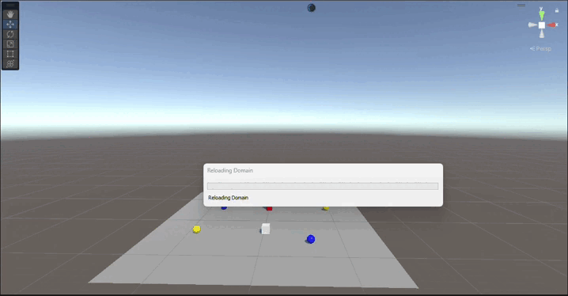
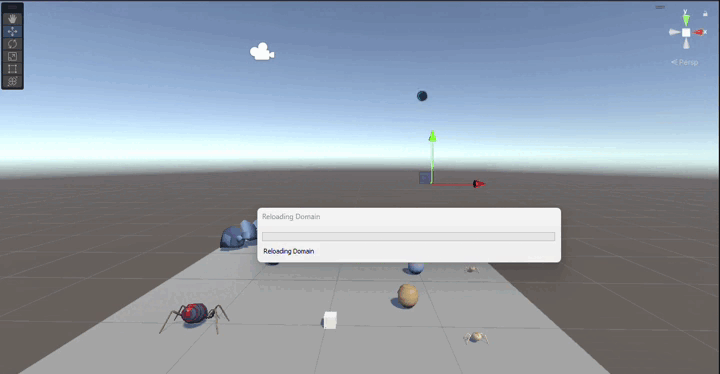
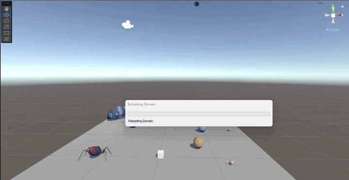
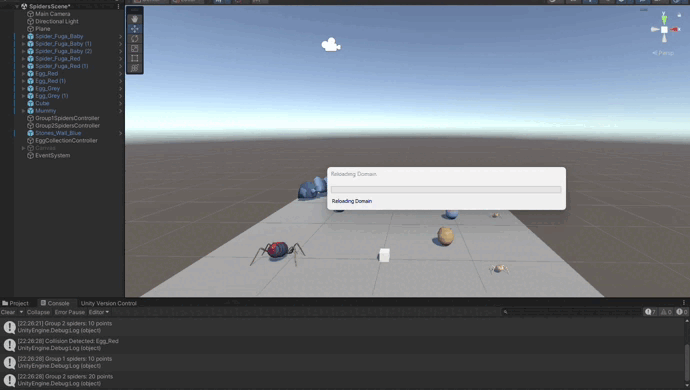
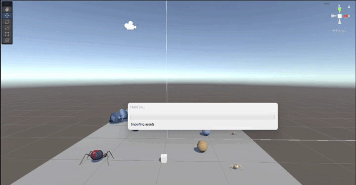
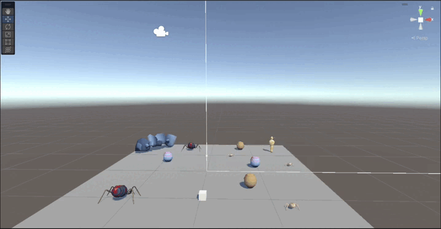
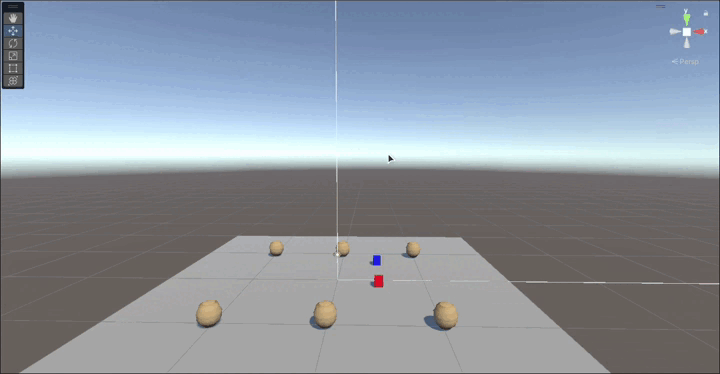

# Practica4_II

En esta práctica se ha empezado a trabajar con los eventos, los delegados y con la UI.

## Ejercicio 1

Para la realización de este ejercicio se ha hecho uso de los eventos para que cuando el cilindro detecte una colisión con el cubo se lance un evento para que las esferas del grupo 1 se dirijan a una de las esferas del grupo 2, previamente fijada, y las esferas del grupo dos se dirigen hacia el cilindro.

## Ejercicio 2

Para la realización de este ejercicio lo único que se hizo fue sustituir los elementos de la escena por los distinto prefabs que contiene el paquéte [Fuga spiders](https://assetstore.unity.com/packages/3d/characters/creatures/fuga-spiders-with-destructible-eggs-and-mummy-151921).

## Ejercicio 3

Para la realización de este ejercicio se ha creado un script en el cual se detectan las colisiones del cubo con las arañas, dependiendo del grupo al que pertenezca la araña con la que colisiona se lanza un evento u otro, en caso de chocar con una araña del grupo 1 se lanza un evento que hace que las arañas de este mismo grupo se dirijan a el huevo del grupo 2 más cercano. Por otro lado, cuando el cubo colisiona con una araña del grupo 2 se lanza un evento que hace que las arañas del grupo 1 se dirijan hacia un objeto situado en la escena.

## Ejercicio 4

Para este ejercicio se creó un script que detecta cuando el cubo está cerca de un objeto especifico de la escena, cuando la distancia entre el cubo y dicho objeto es menor que 5, se lanza un evento que hace que las arañas del grupo 1 se teletransporten a un huevo, previamente fijado, y que las arañas del grupo dos se orienten hacia un objeto situado en la escena.

## Ejercicio 5

Para este ejercicio se ha creado un script el cual se suscribe a un evento que se lanza cuando el cubo colisiona con un huevo, cuando esto ocurre se le suman 10 puntos al contador de puntos de las arañas del grupo 2 y se le suman 5 puntos al contador de puntos de las arañas del grupo 1. Estos contadores se van mostrando por consola cada vez que se se incrementan.

## Ejercicio 6

Para este ejercicio simplemente se reciclo el script anterior y se añadio una interfaz donde se muestran los puntos que se van recolectando.

## Ejercicio 7

En este ejercicio unicamente se añadio un nuevo contador para las recompensas que se incrementa cuando se suma un total de 100 puntos, además, se añadio un nuevo texto a la interfaz donde se va mostrando la cantidad de recompensas que se han obtenido.

## Ejercicio 8

Para este ejercicio he creado una escena donde nos encontramos con dos cubos, los cuales representan a dos jugadores, uno de ellos se mueve con las teclas W, A, S, D y el otro con las flechas del teclado. Cuando uno de los jugadores colisiona con un huevo, los cuales estan repartidos por la escena, se le suman 5 puntos. Cuando uno de los jugadores llega a los 20 puntos se muestra en la interfaz que ha ganado la partida.

## Ejercicio 9

En este ejercicio no se ha realizado ningún cambio, puesto que, desde un primer momento el cubo ha sido un objeto físico